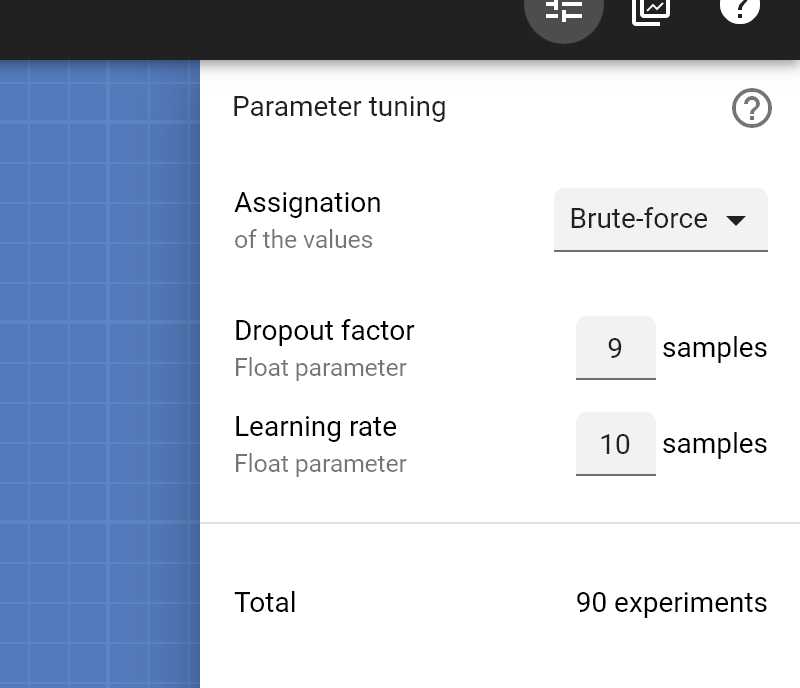

A visual tool for implementing machine learning pipelines.

## No programming involved

Prepare your data and train multiple models just by connecting a few cards.

## Find the best model

Automatically find the optimal value for any parameter of your pipeline.

## All results organized

Keep track of all your experiments.

## Integrated cross-sectional analysis.

Study the effect of a certain parameter on the result.

## Write faster

Export experimental data to  with a single click.

[foto de la misma tabla y chart en latex]

## No installation required

Protopipe is a web platform accessible from any web browser, operating system and device.

    

## Getting started

Read [the basics](basics.html) to learn how to use Protopipe.

However, if you prefer to learn by doing, follow [this quick introductory tutorial](tutorials/introductory).
