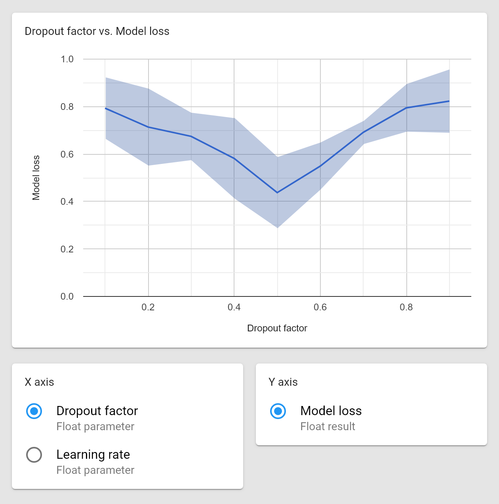
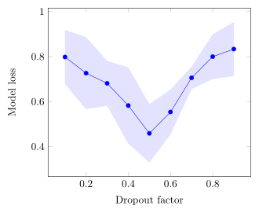

A visual tool for implementing machine learning pipelines.

## No programming involved

Prepare your data and train multiple models just by connecting a few cards.

## Find the best model

Automatically find the optimal value for any parameter of your pipeline.

## All results organized

Keep track of all your experiments.

## Integrated cross-sectional analysis

Study the effect of each parameter on the final result.

## Write faster

Export experimental data to  with a single click.

<!--
LaTeX table:

% Please add the following required packages to your document preamble:
% \usepackage{booktabs}
\begin{table}[]
\center
\begin{tabular}{@{}rrr@{}}
\toprule
Dropout factor & Learning rate & Model loss \\ \midrule
0.5            & 0.001         & 0.4125     \\
0.6            & 0.001         & 0.4253     \\
0.4            & 0.01          & 0.5523     \\
0.3            & 0.01          & 0.6725     \\
0.7            & 0.1           & 0.6324     \\
0.5            & 0.1           & 0.6987     \\ \bottomrule
\end{tabular}
\caption{Best results for each learning rate.}
\label{tab:my-table}
\end{table}

LaTeX chart:

\documentclass{article}
\usepackage{pgfplots}
\begin{document}
\thispagestyle{empty}
\begin{tikzpicture}
\begin{axis}[
xlabel=Dropout factor,
ylabel=Model loss]
\addplot+[error bars/.cd,y dir=both,y explicit] 
coordinates {
	(0.1, 0.7985)   +- (0, 0.12)
	(0.2, 0.7265)	+- (0, 0.16)
	(0.3, 0.6812)	+- (0, 0.1)
	(0.4, 0.5823)	+- (0, 0.17)
	(0.5, 0.4589)	+- (0, 0.13)
	(0.6, 0.5538)	+- (0, 0.1)
	(0.7, 0.7058)	+- (0, 0.05)
	(0.8, 0.7999)	+- (0, 0.1)
	(0.9, 0.8335)	+- (0, 0.12)
};
\end{axis}
\end{tikzpicture}
\end{document}
-->

## No installation required

Protopipe is a web platform accessible from any web browser, operating system and device.

    

## Getting started

Read [the basics](basics.html) to learn how to use Protopipe.

However, if you prefer to learn by doing, follow [this quick introductory tutorial](tutorials/introductory).
