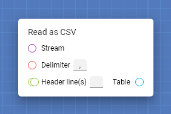
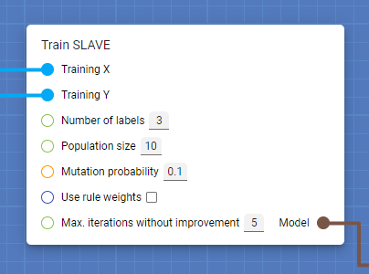
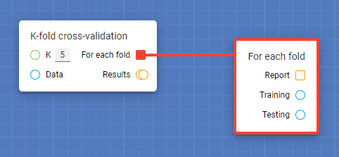
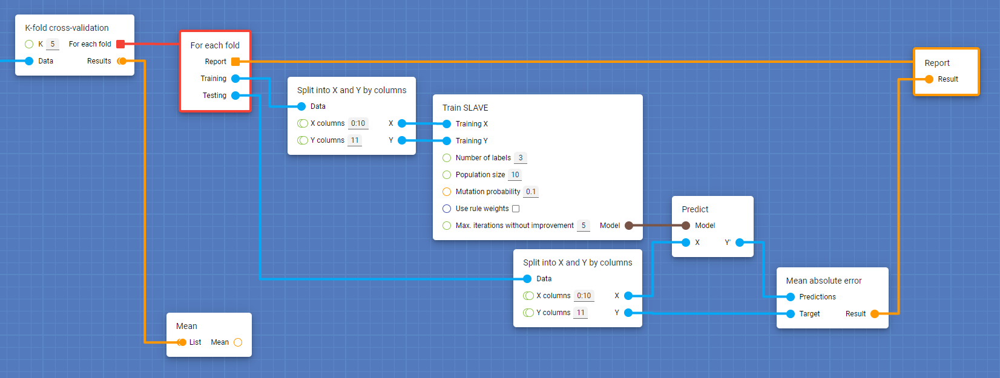

## The basics

This page explains everything you need to know to use Protopipe.

If you prefer to **learn by doing**, you can follow [this quick introductory tutorial](tutorials/introductory).

### Pipeline design

**Cards** are the main pillar of Protopipe.

Cards are like **functions** of any common programming language---they receive some inputs, they do something, they return some outputs.

For instance:

* The [Mean](cards/mean.html) card receives a list of numbers and returns their mean.
* The [Train SLAVE](cards/trainSLAVE.html) card receives a training dataset, trains a fuzzy logic model and returns it.
* The [Predict](cards/predict.html) card receives a model plus the inputs of a test dataset and returns the model's predictions.

To design a pipeline of a experiment, just put the proper cards in the blueprint and connect them.

The inputs of a card are at its left and the outputs at its right. They can be of different **types** (e.g., [String](types/String.html), [Integer](types/Integer.html), [Float](types/Float.html)) and you can recognize them by the **color** and **shape** of the socket.

For instance a [String](types/String.html) is represented by a red circle, a list of multiple [Strings](types/String.html) by **two** red circles, a [Callback](types/Callback.html) by an orange square, etc.

You can directly provide a value for some specific kind of inputs. See [this page](work_screen.html#provide-an-input-directly) for more information.

Cards aim to be general and atomic so they can be used in lots of different situations, but also complete and handy enough so you do not need to use hundreds of them for performing a simple task.

#### Events and callbacks

When a card outputs an [Event](types/Event.html), you can assign a **listener** card to it.

When the first card gets processed, it may---or may not---**trigger** the event. If the event gets triggered, the listener card will get processed too.

The listener card provides some outputs that you can connect to other cards, and they will get processed too.

In certain situations it is not enough for a card to receive some inputs and just return some outputs. In some cases it is required that it generates an output, other cards do something with it and send it back to the original card, that takes the control again to generate a final output. This situation can be covered with [Events](types/Event.html) and [Callbacks](types/Callback.html).

A card triggers an [Event](types/Event.html) that provides a [Callback](types/Callback.html); when the listener gets processed, it calls the [Callback](types/Callback.html) and the execution control goes back to the original card so it can perform its final action.

An example of this architecture is found in the [K-fold cross-validation](cards/kFoldCrossValidation.html) card, that lets you define the pipeline of every fold just once, instead of having to define it *K* times:

#### Parameters

Protopipe can find approximated optimal values for the parameters of your model (e.g., number of layers in a neural network or mutation probability in a genetic algorithm).

There is a special set of cards that represent parameters to optimize. Some of them, such as the [Float parameter](cards/parameterFloat.html), let you specify a **domain** in order to narrow down the search.

[foto parameter]

#### Returns

Protopipe lets you analyze the results obtained from your experiments and perform some interesting tasks, like **cross-sectional analysis**.

There is a special kind of cards---the **"Return"** cards---that collect values for the later analysis phase. For example, the [Return float](cards/returnFloat.html) card stores a [Float](types/Float.html) value to show it in the reports.

[foto return]

[foto report]

[foto cross-sectional]

### Parameter optimization

Most machine learning models and data preprocessors can be fine tuned with parameters (e.g., the number of layers of a neural network, the threshold of an image binarizer, or the mutation probability of a genetic algorithm).

These parameters have a **huge** effect on the performance of a model and it is not trivial to find their optimal value, since it basically depends on the intrinsic properties of the data under study.

Although there is a lot of literature on how to choose the right values for some of these parameters, in most cases it is unfeasible to predict the final behavior of the model, so the common approach is to find the optimal values by actual experimentation. In this area there are different strategies that can be followed:

* Try every possible value and combination of each parameter.
* Use an auxiliar optimizing method (e.g., genetic algorithm, bayesian networks).
* Try random values for *n* iterations.
* etc.

The only thing in common among all these methods is that you need to perform an **immense** amount of experiments in order to have a good approximation.

Protopipe automatizes the search, following any of the multiple configurable methods available.

[foto optimizer]

See [this page](work_screen.html#tune-parameters-automatically) for more information.

### Result analysis

After performing a set of experiments, Protopipe generates a table where each row represents a single experiment containing all values assigned to [parameter cards](#parameters) and all values obtained from [return cards](#returns). This may help, for instance, to know what combination of learning rate and dropout factor leads to the lowest testing error.

[foto tabla]

Protopipe also has an integrated interactive tool for performing **cross-sectional analysis** between a parameter and a return value, letting you know, for instance, how the number of layers affects the performance of your neural network.

[foto cross sectional]

See [this page](reports_screen.html) for more information.
