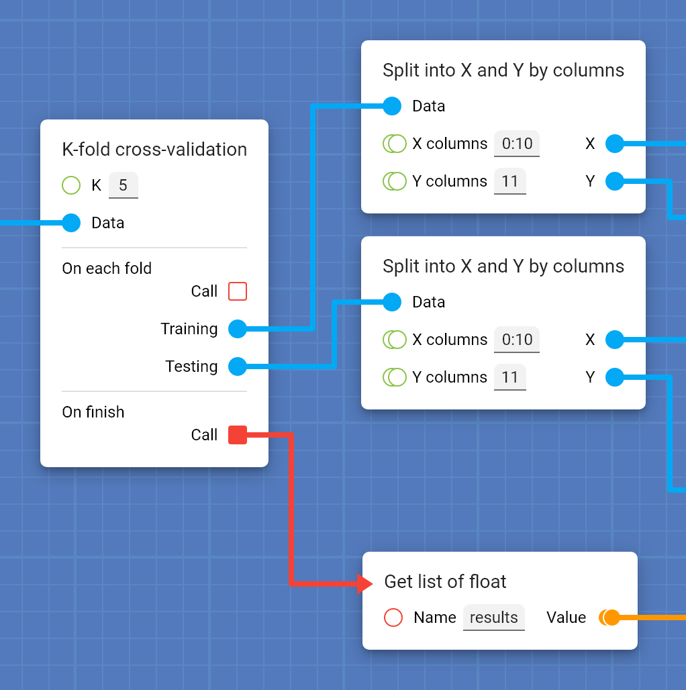

## The basics

This page explains everything you need to know to use Protopipe. Don't worry, it's not much.

If you feel more confortable following a **tutorial**, open [this link](tutorials/intro.html).

### Design

**Cards** are the main pillar of Protopipe.

Cards are like **functions** of any common programming language: they receive some inputs, they do something, they return some outputs.

Examples:

* The [Mean](cards/mean.html) card receives a list of numbers and returns their mean.
* The [Train SLAVE](cards/trainSLAVE.html) card receives a training dataset, trains a fuzzy logic model and returns it.
* The [Predict](cards/predict.html) card receives a model plus the inputs of a test dataset and returns the model's predictions.

You can design a pipeline for your experiments just by putting some cards in the blueprint and connecting them.

The inputs of a card are at its left and the outputs at its right. They can be of different **types** (e.g., [String](types/String.html), [Integer](types/Integer.html), [Float](types/Float.html)) and you can recognize them by the **color** or **shape** of the socket.

For instance a [String](types/String.html) is represented by a red circle, a list of multiple [Strings](types/String.html) by **two** red circles, a [Callback](types/Callback.html) by an orange square, etc.

You can directly provide a value for some specific kind of inputs. See [this page](work_screen.html#provide-an-input-directly) for more information.

Cards aim to be general and atomic enough so they can be used in lots of different cases, but also complete and handy enough so you don't need to create hundreds of them for performing a simple task.

#### Events and callbacks

When a card outputs an [Event](types/Event.html), you can assign a **listener** card to it.

When the first card gets processed, it may---or may not---trigger the event. If the event gets triggered, the listener card will get processed too.

The listener card provides some outputs that you can connect to other cards, and they will get processed too.

Sometimes it is not enough for a card to receive some inputs and return some outputs. In some cases it is required that it generates an output, other cards do something with it and send it back to the original card, that takes the control again to generate a final output.

This situation can be covered with [Events](types/Event.html) and [Callbacks](types/Callback.html): a card triggers an [Event](types/Event.html) that provides a [Callback](types/Callback.html); when the listener gets processed, it calls the [Callback](types/Callback.html) and the execution control goes back to the original card so it can perform its final action.

An example of this architecture is found in the [K-fold cross-validation](cards/kFoldCrossValidation.html) card, that lets you define the pipeline of every fold just once, instead of having to define it *K* times:

#### Parameters

Protopipe can find approximated optimal values for the parameters of your model (e.g., number of layers in a neural network or mutation probability in a genetic algorithm).

[foto parameter]

There is a special set of cards that represent parameters that need to be optimized. Some of them, such as the [Float parameter](cards/parameterFloat.html) lets you specify a **domain** in order to simplify the search.

#### Returns

Protopipe lets you analyze the results of your experiments and do cool things such as **cross-sectional analysis**. You just need to specify what values you want to collect from your experiments.

[foto return]

There is a special set of cards that collect a value for the later analysis phase. For example, the [Return float](cards/returnFloat.html) card stores a [Float](types/Float.html) value that appears later in the reports.

### Optimization

[foto optimizer]

Most machine learning models can be fine tuned with parameters, such as the number of layers or neurons per layer of a neural network, the population size or the mutation probability of a genetic algorithm or the grade of a regression.

These parameters have a **huge** effect on the performance of the model and it is not trivial to assign them a value, since it usually depends on the intrinsic properties of the data that is used for training.

Although there is a lot of literature about how to choose the right values, in most cases **it is unfeasible to predict the final behavior of the model**, so the common approach is to find the optimum by actual experimentation.

At this point there are different strategies that can be followed:

* Try every possible value and combination of each parameter.
* Use an auxiliar optimizing method (e.g., genetic algorithm, bayesian networks).
* Try random values for *n* iterations.
* etc.

The only thing in common among all these methods is that you need to perform an **immense** amount of experiments in order to have a good approximation.

Protopipe does this search for you, letting you choose your prefered method and the domain of possible values for each parameter. Say goodbye to those cumbersome python scripts!

### Analysis

[foto cross sectional]

After performing a series of experiments, some questions may arise. Probably you may want to know what combination of learning rate and dropout results in the lowest error, or how the number of layers affects the performance of a neural network.

Protopipe answers these questions by:

* Automatically generating tables that relate the values assigned to the [parameter cards](#parameters) with the values obtained from the [return cards](#returns)
* Offering an interactive tool for performing **cross-sectional analysis** and drawing cool charts, letting you know how each parameter affects the outcome.
