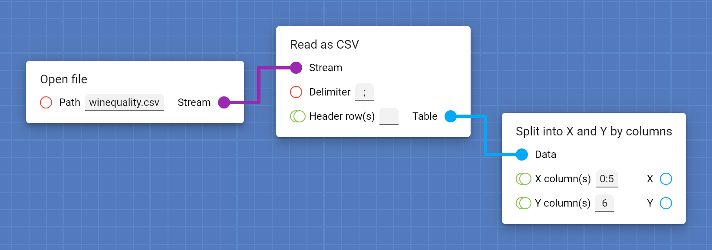
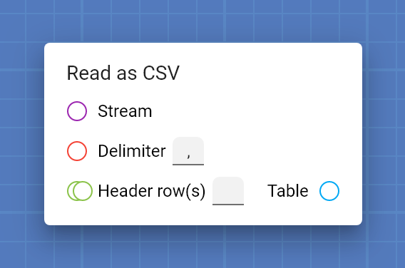
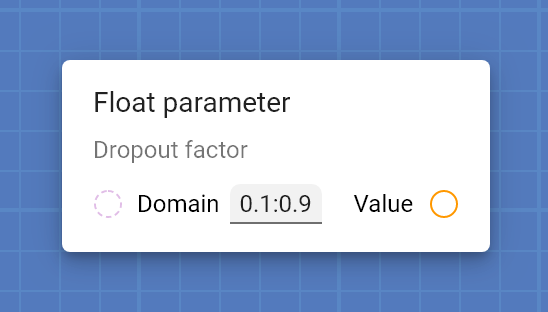
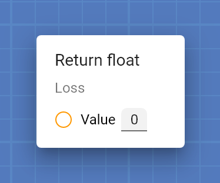
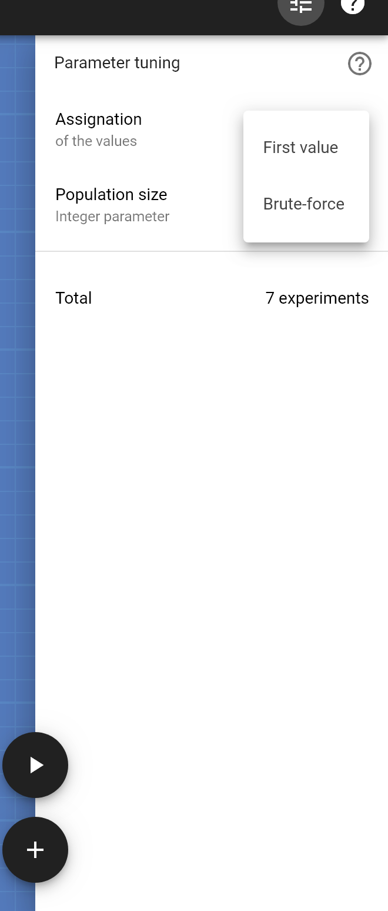
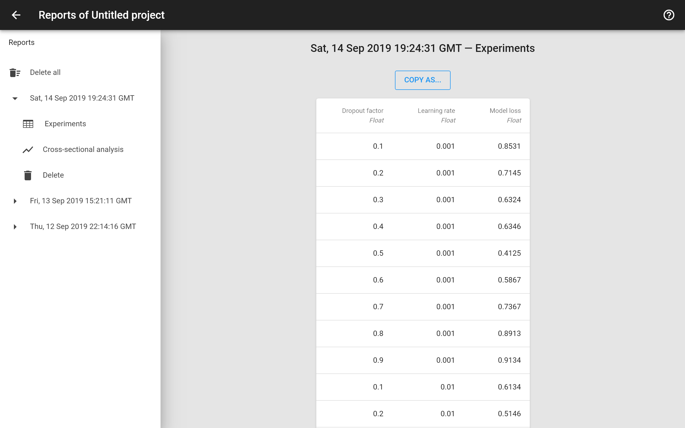
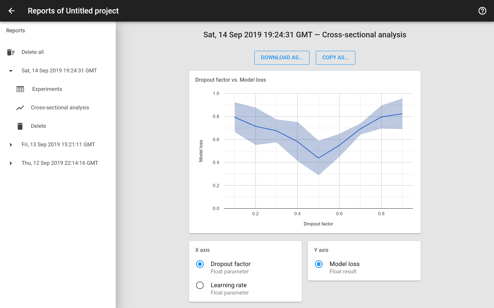

## The basics

This page explains everything you need to know to start using Protopipe.

If you prefer to learn by doing, you can follow [this quick introductory tutorial](tutorials/introductory).

### Pipeline design

**Cards** are the main pillar of Protopipe.

Cards are like **functions** of any common programming language: they receive some inputs, do something and return some outputs.

For instance:

* The [Mean](cards/mean.html) card receives a list of numbers and returns their mean value.
* The [Train SLAVE](cards/trainSLAVE.html) card receives a training dataset, trains a fuzzy logic model and returns it.
* The [Predict](cards/predict.html) card receives a model plus the inputs of a test dataset and returns the model's predictions.

To design a pipeline of a experiment, just add cards to the blueprint and connect them.

The inputs of a card are at its left and the outputs at its right. They can be of different **types** (e.g., [String](types/String.html), [Integer](types/Integer.html), [Float](types/Float.html)) and you can recognize them by the **color** and **shape** of the socket.

For instance a [String](types/String.html) is represented by a red circle, a list of [Integers](types/Integer.html) by **two** green circles, a [Tensor](types/Tensor.html) by a blue square, etc.

You can directly provide a value for some specific kind of inputs, such as [Strings](types/String.html) or [Integers](types/Integer.html). See [this page](work_screen.html#provide-an-input-directly) for more information.

Cards aim to be general and atomic so they can be used in lots of different situations, but also complete and handy enough so you do not need to use hundreds of them for performing a simple task.

#### Events

Some cards have the ability of triggering [Events](types/Event.html) when they are processed. In the example above, card [K-fold cross-validation](cards/kFoldCrossValidation.html) triggers the *On each fold* event K times and the event *On finish* at the end.

All events have a socket for explicitly calling other cards. Cards connected to that socket are called **explicit listeners**. In the example above, card [Get list of float](cards/getFloat_n.html) is an explicit listener of the *On finish* event.

Events can have associated data, only available when they are triggered. In example above event *On each fold* has two associated [Tensors](types/Tensor.html) *Training* and *Testing*, while event *On finish* has no associated data at all.

Cards that receive the associated data of an event as input are called **implicit listeners**. In the example above, cards [Split into X and Y by columns](cards/splitIntoXAndYByColumns.html) are implicit listeners of the *On each fold event*.

Explicit and implicit listeners are processed only when the event is triggered. If the event is not triggered, these cards or the cards connected to their outputs are never processed.

#### Parameters

Protopipe can find approximated optimal values any parameters of your model (e.g., number of layers in a neural network or mutation probability in a genetic algorithm).

There is a special set of cards that represent parameters that must be optimized, the **parameter cards**. Some of them, such as the [Float parameter](cards/parameterFloat.html), let you specify a **domain** in order to narrow down the search space.

When processing a project, the optimizer will perform multiple experiments, analyzing the previous results and assigning new values to parameter cards on each iteration. After a certain number of iterations, the parameter cards will output approximated optimal values.

See [this page](work_screen.html#tune-parameters-automatically) for more information.

#### Returns

Protopipe lets you analyze the results obtained from your experiments and perform some interesting tasks, like **cross-sectional analysis**.

There is a special set of cards that collect values for the later analysis phase, the **return cards**. For example, the [Return float](cards/returnFloat.html) card stores a [Float](types/Float.html) value to show it later in the generated report.

See [this page](reports_screen.html) for more information.

#### Variables

TODO

### Parameter optimization

Most machine learning models and data preprocessors can be fine tuned with parameters. For instance, you would like to find the right number of layers of a neural network, the optimal threshold of an image binarizer, or the best mutation probability of a genetic algorithm.

These parameters have a **huge** effect on the performance of a model and it is not trivial to find their optimal value, since it basically depends on the intrinsic properties of the data under study.

Although there is a lot of literature on how to theoretically choose the right values for some of these parameters, in most cases it is unfeasible to predict the final behavior of the model, so the common approach is to find the optimal values by actual experimentation.

In this area there are different strategies available:

* Try every possible value and combination of each parameter.
* Try random values for *n* iterations.
* Use an external optimizing method (e.g., bayesian networks, genetic algorithm).

The only thing in common among all the strategies is that you need to perform an **immense** amount of experiments in order to have a good approximation.

Protopipe comes equipped with several optimizing methods that automatize the search.

See [this page](work_screen.html#tune-parameters-automatically) for more information.

### Result analysis

After processing a project, Protopipe generates a table where each row represents a single experiment containing all values assigned to [parameter cards](#parameters) and all values obtained from [return cards](#returns). This may help, for example, to know what combination of *learning rate* and *dropout factor* leads to the lowest *testing loss*.

Protopipe also has an integrated interactive tool for performing **cross-sectional analysis** between parameters and return values, letting you know, for example, how the *number of layers* affects the *accuracy* of your neural network.

See [this page](reports_screen.html) for more information.
