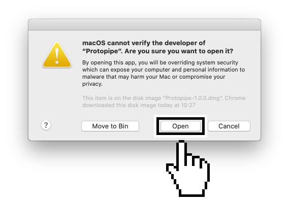

<ul class="breadcrumb">
    <li><a href="">Home</a></li>
    <li><a href="download">Download</a></li>
    <li>macOS installation instructions</li>
</ul>

## Careful

You are downloading a **beta version**, still under development, still not signed, so macOS will prevent you from running it.

{:.originalSize.noShadow}

To run Protopipe, follow these steps:

Open *System Preferences* and click on "Security & Privacy".

{:.originalSize.noShadow}

Click on "Open Anyway".

{:.originalSize.noShadow}

Click on "Open".

{:.originalSize.noShadow}
