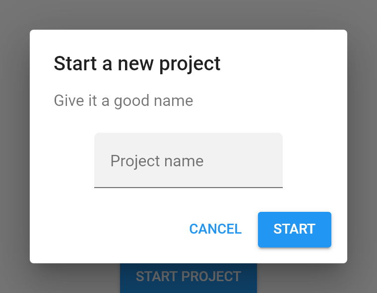
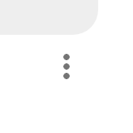
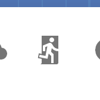

<ul class="breadcrumb">
    <li><a href="">Home</a></li>
    <li><a href="help.html">Help index</a></li>
    <li>Projects screen</li>
</ul>

## Projects screen

In this screen you can manage your projects.

### Create a new project

Press the *Create new project* button.

Write a name for the new project.

And press **Start**.

### Open a project

Press the project you want to open.

### Rename a project

Open the options menu of the project.

Press **Rename**. A new dialog will appear.

Write a new name and press **Rename**.

### Delete a project

Open the options menu of the project.

Press **Delete**. A new dialog will appear.

Press **Delete**.

### Export and download a project

Open the options menu of the project.

And press **Download**.

### Upload and import a project

Press the *Upload* button.

And select from your computer the ZIP file containing the project.

### Log out

Press the *Log out* button:

