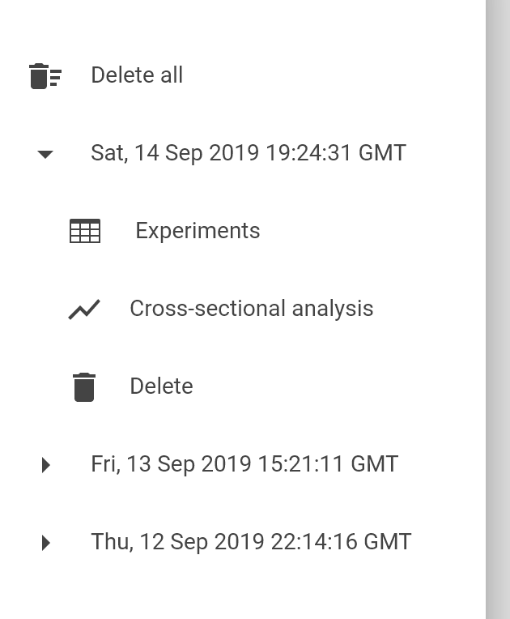
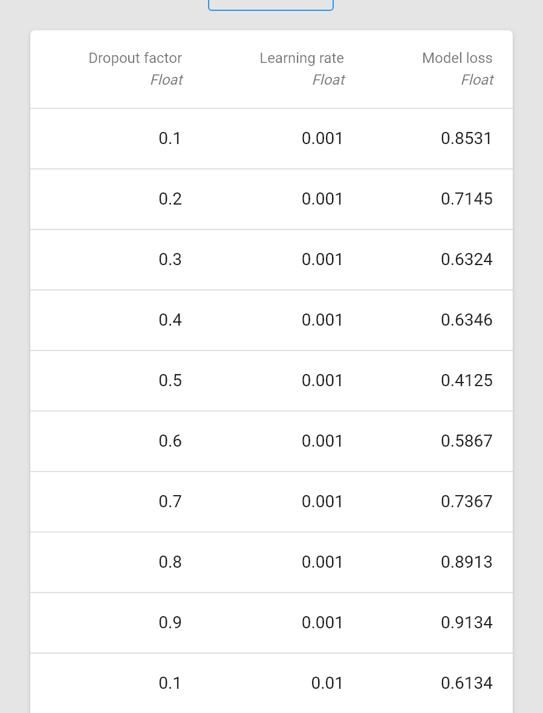

## Reports screen

In this screen you can consult the reports of the experiments you carried out and perform a cross-sectional analysis between the parameters and the results of your pipeline.

### Open a report

The left panel shows all available reports, sorted by date. Expand the section of the report you want to open and press **Experiments**.

A table will appear in the center of the screen, containing a column for each parameter and return value of your pipeline and a row for each experiment the system performed during the project processing.

### Cross-sectional analysis

The left panel shows all available reports, sorted by date. Expand the section of the report you want to open and press **Cross-sectional analysis**.

A chart will appear in the center of the screen, with two panels at the bottom. Choose the parameter you want to study in the left panel and a return value in the right one.

The system will display a line connecting the average return values obtained for each parameter value.

If there are multiple parameters, the system will probably perform more than one experiment for a given combination of parameters and return values---depends on the optimization method you choose---.

For example, let's suppose that your pipeline has two parameters:
* *Learning rate*, that can be 0.001, 0.01 or 0.1.
* *Dropout factor*, that can take any value between 0.1 and 0.9.

Let's also suppose that you use the **Brute-force** optimizer configured for sampling *Learning rate* 3 times (0.001, 0.01, 0.1) and *Dropout factor* 9 times (0.1, 0.2, 0.3, ..., 0.9).

In this case the system will try every possible combination of parameters, performing 27 experiments in total; or in other words, it performs 3 experiments for each possible *Dropout factor*, obtaining 3 different *Model loss*.

If you use the cross-sectional analysis tool for comparing *Dropout factor* and *Model loss* the system will display a line connecting the average *Model loss* obtained for each *Dropout factor*. Also, in each point, the system will display a column representing the standard deviation of *Model loss* for that specific *Dropout factor*.

### Delete a report

The left panel shows all available reports, sorted by date. Expand the section of the report you want to open and press **Delete**.

### Delete all reports

Press **Delete all** in the left panel.

