## Work screen

[foto work screen]

In this screen you can design and test a pipeline for your machine learning experiments.

If you feel more confortable following a tutorial, open [this link](TODO).

This is page explains how to use the graphical interface of this screen. If you are more interested in knowing the basics of Protopipe, go [here](basics.html).

### Create a card

Right click on an empty space of the blueprint or press this button to open the card menu:

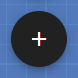

In the **Data** tab you will be able to upload files of any type, that supposedly contain the data required for your experiments. After uploading a file, you can click on their entry in the menu to create an [Open file](cards/openFile.html) card, that returns a [FileStream](types/FileStream.html) that can be read by another card (e.g., [Read as CSV](cards/readAsCSV.html)).

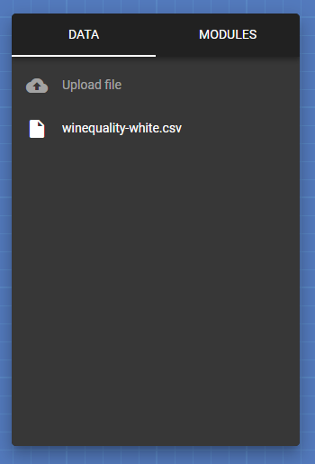

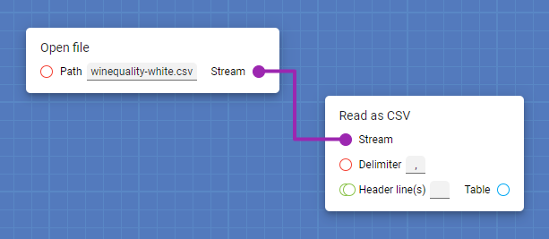

In the **Modules** tab you will see a catalog of all the cards available in the system, classified in a tree. If you click on a module, the card will be created in the blueprint.

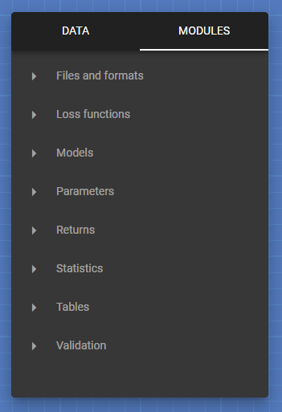

### Select cards

Select cards by clicking on them (press `Ctrl` while clicking to select multiple cards) or by surrounding them with a rectangle.

[gif click para seleccionar]

[gif seleccion rectangular]

### Delete cards

Select all the cards you want to delete ([how?](#select-cards)) and press this button on the top bar:

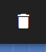

### Connect two cards

Drag & drop the input socket of one card into the output socket of another (or viceversa).

[gif connect 2 cards]

Please, note that both sockets must be of the same type (i.e. same color and shape), otherwise the system will do absolutely nothing.

### Delete a connection

Drag & drop the **input** of the connected card into an empty space of the blueprint.

[gif remove connection]

Do not drag the **output** of the other connected card, since that would only create a new connection instead.

### Create an Event listener card

To create an [Event](types/Event.html) listener card, drag & drop the [Event](types/Event.html) socket into any empty space of the blueprint.

[gif crear event card]

### Create a Callback card

To create a [Callback](types/Callback.html) card, drag & drop the [Callback](types/Callback.html) socket into any empty space of the blueprint.

[gif crear callback]

### Provide an input directly

For some types of input, it is possible to directly provide their value:

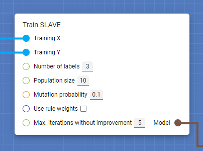

These are the input types that allow that:

* [String](types/String.html)
* [Integer](types/String.html)
* [Float](types/String.html)
* [Boolean](types/String.html)
* List of [Integer](types/String.html)---write a comma-separated list of integers and closed intervals.
* List of [Float](types/String.html)---write a comma-separated list of floats.
* [IntegerRanges](types/IntegerRanges.html)---write a comma-separated list of integers and closed intervals.
* [FloatRanges](types/FloatRanges.html)---write a comma-separated list of floats and closed intervals.

To define a closed interval from A to B just write "A:B".

### Preview the output of a card

Select the card with the output you want to preview ([how?](#select-cards)) and press this button:

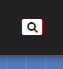

If the card has multiple outputs, a menu will appear to select the desired output.

After that, a dialog will show a small portion of the data.

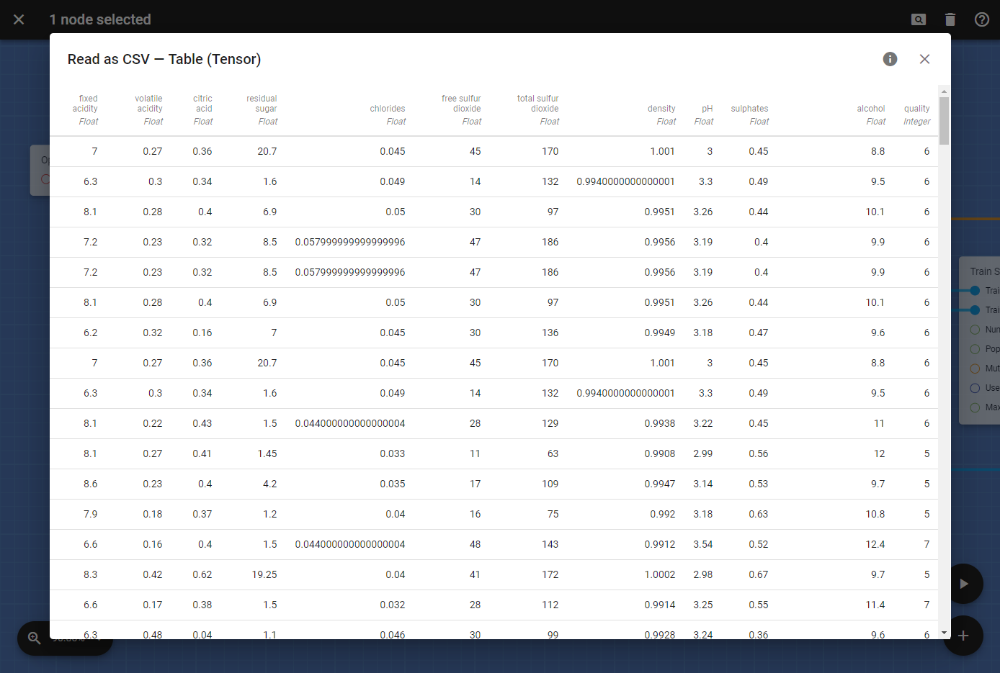

For some types of data the system will show a button for obtaining more information (e.g., the number of rows and columns in a table):

### Process the project

Click on this button:

A new panel will appear at the side of the screen. It contains some live information about the state of the processing.

[foto panel]

After the process finishes, a dialog will appear:

[foto dialog success]

If the process stops prematurely, due to a manual stop or an internal error of the system, this dialog is shown:

[foto dialog error]

You can stop the process whenever you want by clicking this button:

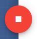

Note the project is not editable during the processing. Stop the process to make any change.

### Tune parameters automatically

To let the system find an optimal value for a parameter, first create a parameter card.

For example, create an [Integer parameter](types/parameterInteger.html) card:

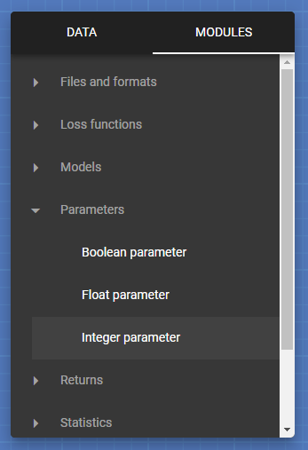

The system will ask you to give it a name. Write something descriptive, like "Population size".

[foto dialogo nombre]

After that, a new card will appear:

[foto card int param]

Now it's time to define the domain of the parameter. In this example we will specify that this parameter can have any value from 5 to 11, both included:

[foto card int param con domain 5:11]

Connect the output of the parameter card to the input of any card you wish. For instance, let's connect it to the [Train SLAVE](cards/trainSLAVE.html) card:

[foto int parameter conectado a train slave]

When the pipeline contains optimizable parameters, the top bar shows a button for adjusting the tuning settings:

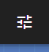

If you press it, a new panel appears at the side of the screen:

[foto panel tune]

Here you can choose the optimization method the system will use. Each method has its own settings.

For instance, if we choose **Bruteforce**, the system will try every possible value of the domain of the parameters.

As you can see, it is possible to choose how many samples from the parameter's domain we want to try. Let's write "3" for our parameter.

If we process the project ([how?](#process-the-project)), the system will perform 3 experiments:

[foto table Population size 5, 8, 11 & result]

Note that the system takes the samples uniformly along the specified domain.

If we had another optimizable parameter with 5 samples, the system would try every possible combination of both parameters, resulting in 15 experiments.

### Analyze the results

After the project has been processed ([how?](#process-the-project)), the system generates a report and this button is shown in the top bar:

[foto boton reports]

Click on it to open the report screen. Please, continue reading [here](reports_screen.html).
