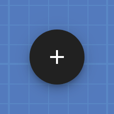
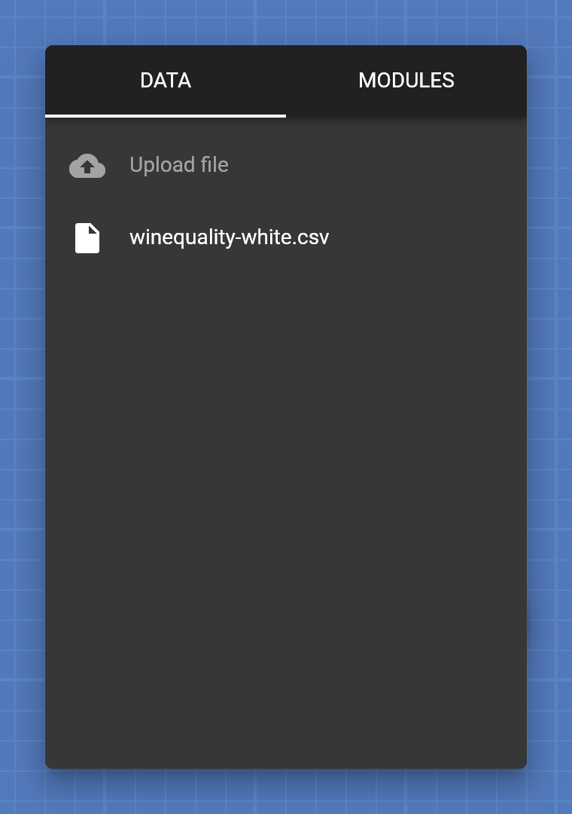
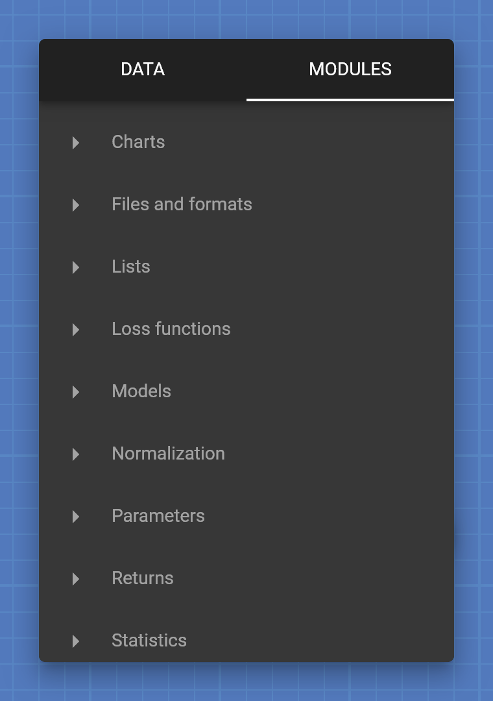
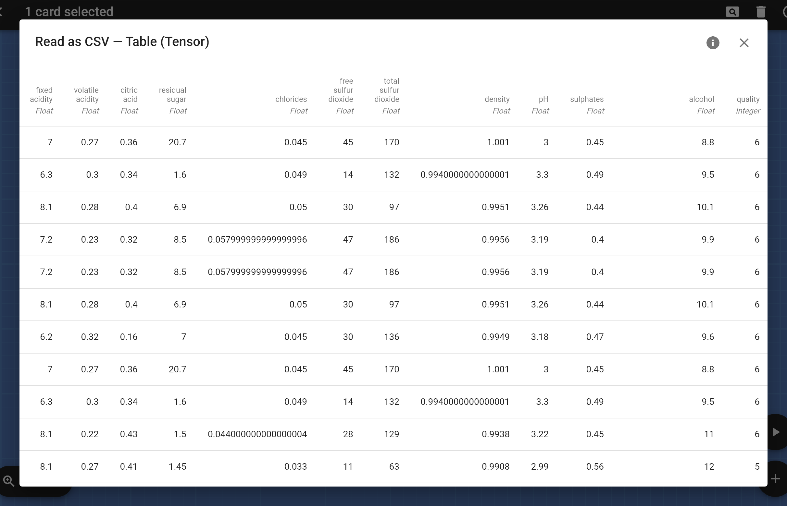
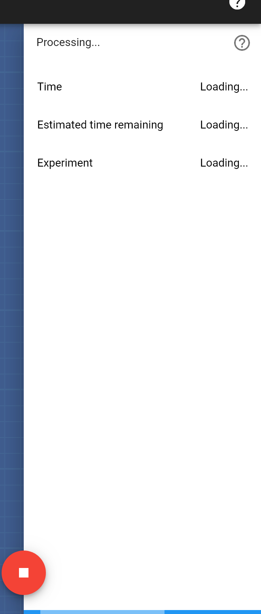
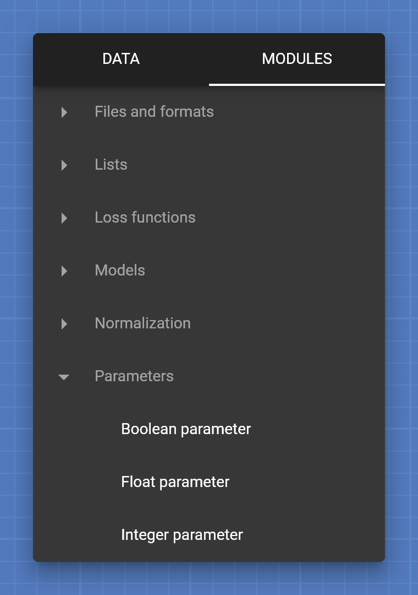
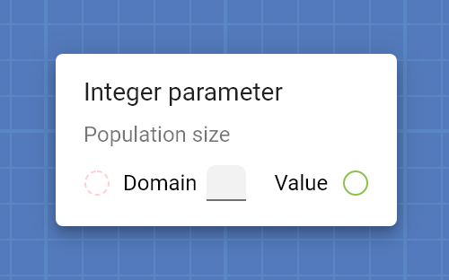
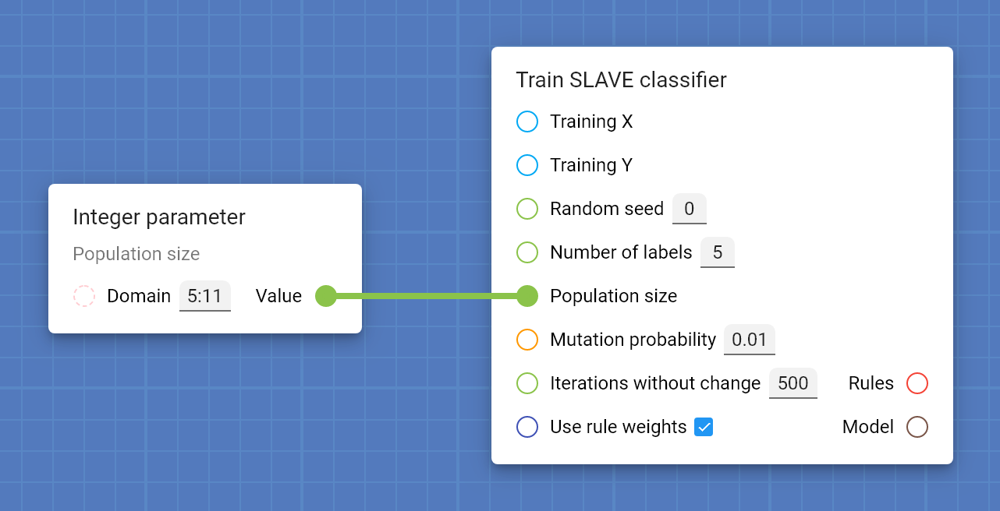
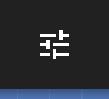
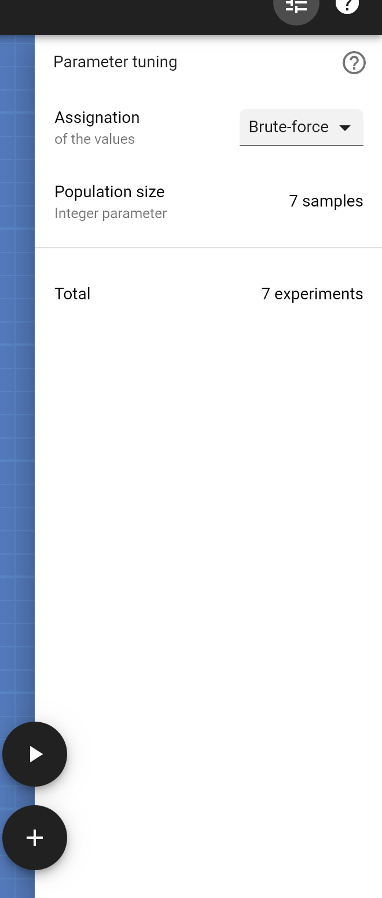

<ul class="breadcrumb">
    <li><a href="">Home</a></li>
    <li><a href="help">Help index</a></li>
    <li>Work screen</li>
</ul>

## Work screen

In this screen you can design and test machine learning pipelines.

This is page explains how to use the main graphical interface of Protopipe. If you are more interested in learning the basics of Protopipe, see [this page](basics).

However, if you prefer to learn by doing, follow [this quick introductory tutorial](tutorials/introductory/SLAVE).

### Create a card

Right click on an empty space of the blueprint or press the *Create card* button to open the menu.

In the **Data** tab you will be able to upload files of any type with the data required for your experiments. After uploading a file, you can press their entry in the menu to create an [Open file](cards/openFile) card.

The [Open file](cards/openFile) card outputs a [FileStream](types/FileStream) that can be read by other cards, for example, the [Read as CSV](cards/readAsCSV) card.

The **Modules** tab contains a catalog of all the cards available in the system, organized by categories. If you press a module, the card will be added to the blueprint.

### Select cards

Select cards by pressing them (press `Ctrl` while pressing to select multiple cards) or by enclosing them in a selection rectangle.

### Delete cards

[Select](#select-cards) all the cards you want to delete and press the *Delete* button on the top bar.

### Connect two cards

Drag & drop the output socket of one card into the input socket of another (or vice versa).

Please, note that it is only possible connect sockets of the same type (i.e. same color and shape).

### Delete a connection

Drag & drop the **input** of the connected card into an empty space of the blueprint.

Do not drag the **output** of the other connected card, since that would only create a new connection instead.

### Provide an input directly

It is possible to directly provide the value of certain types of inputs.

The types that allow direct values are:

* [String](types/String)
* [Integer](types/String)
* [Float](types/String)
* [Boolean](types/String)
* List of [Integer](types/String)---write a comma-separated list of integers and closed intervals.
* List of [Float](types/String)---write a comma-separated list of floats.
* [IntegerRanges](types/IntegerRanges)---write a comma-separated list of integers and closed intervals.
* [FloatRanges](types/FloatRanges)---write a comma-separated list of floats and closed intervals.

To define a closed interval from A to B, of either [Integers](types/String) or [Floats](types/String), just write "A:B".

### Preview the output of a card

[Select](#select-cards) the card with the output you want to preview and press the *Preview output* button.

If the card has multiple outputs a menu will appear to let you choose the output you want to preview.

After selecting an output, a small portion of the data will be displayed in a dialog.

For some types of data the system will show a button for obtaining more information (e.g., the number of rows and columns in a table).

### Process the project

Press the *Start processing* button.

A new panel will appear at the side of the screen. It contains real-time information about the state of the processing.

You can stop the process at any moment by pressing the *Stop processing* button.

Note that the project is not editable during the processing.

### Fine tune parameters automatically

To let the system find the optimal value of a parameter of your pipeline, first create a parameter card.

For example, create an [Integer parameter](types/parameterInteger) card.

The system will ask you to give it a name. Write something descriptive, like "Population size". After that, a new card will appear.

Now it's time to define the domain of the parameter. In this example we will specify that this parameter can have any value from 5 to 11, both included.

Connect the output of the parameter card to the input you want to optimize. For instance, let's connect it to the [Train SLAVE classifier](cards/trainSLAVEClassifier) card.

When the pipeline contains optimizable parameters, the *Fine tune settings* button appears on the top bar.

If you press it, a new panel appears at the side of the screen.

In this panel you can choose which method the system will use for finding the optimal values for the parameters. Of course, each method has its own set of settings.

For instance, the **Bruteforce** method will test every possible value of the domain of the parameters. If we [process the project](#process-the-project) the system will perform 7 experiments in total.

Moreover, if we had another optimizable integer parameter with a domain size of 5 the system would try every possible combination of both parameters, resulting in 35 different experiments.

### Analyze the results

The result of [processing a project](#process-the-project) is a report. The *Reports* button will appear on the top bar after the first time you process the project.

Press the *Reports* button to open [the reports screen](reports_screen).
